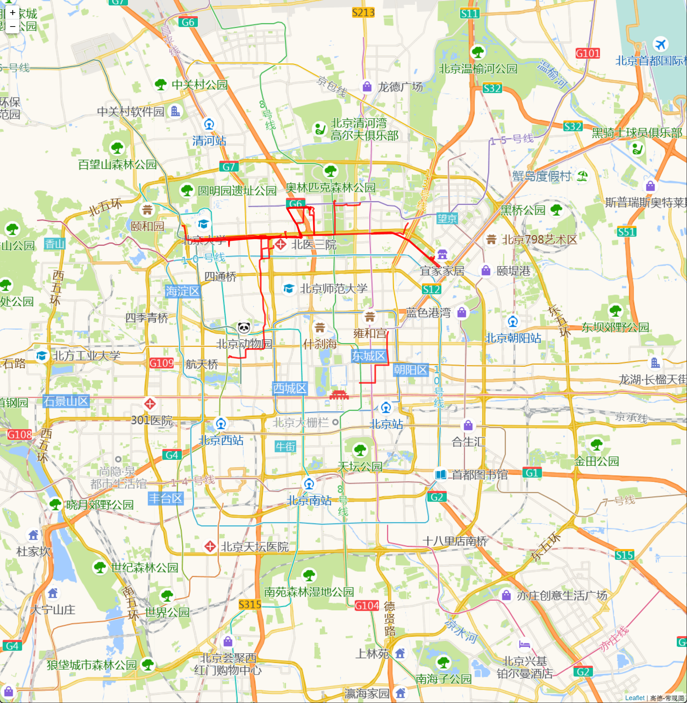

**Taxi Trajectory Location Prediction Based on Geolife Spatiotemporal Trajectory Data**

**Abstract**: With advancements in global positioning and wireless communication technology, mobile terminals like GPS devices and smartphones have generated a large volume of spatiotemporal trajectory data. The acquisition, processing, and analysis of this data have garnered significant attention from academia and industry, with applications in traffic coordination and management, tourism route recommendation, natural disaster early warning, and environmental protection. This paper predicts the pick-up points of taxis in Beijing based on the Geolife spatiotemporal trajectory dataset. Its aim is to provide dispatch suggestions for drivers through taxi dispatch software and to aid in the planning of taxi pick-up points for traffic management departments.

**Keywords**: Spatiotemporal trajectory data, taxi trajectory, location prediction, trajectory data processing, ensemble learning, deep learning

1. **Introduction & Literature Review**

   Spatiotemporal trajectory data is a type of geographic information and generally has high value. Analyzing an individual's spatiotemporal trajectory data can reliably predict traffic conditions, user behavior, and other information.

   In this paper, we analyze the Geolife spatiotemporal trajectory data to extract the taxi trajectory of individual users. We clean, denoise, semantically enhance (segment), and optimize features based on models, then model the data and use classical learning, ensemble learning, and deep learning models for analysis to predict the taxi pick-up points in Beijing. The significance of this prediction lies in providing dispatch suggestions for drivers and planning taxi pick-up points for traffic management departments.

2. **Problem Description**

   Even in the era of widespread use of taxi dispatch technology, the distribution of taxi resources in a city remains uneven. For instance, taxi demand can surge cyclically in shopping malls, commercial complexes, office areas, or residential areas during specific time periods, making it often difficult to catch a cab. Conversely, many empty taxi drivers struggle to find passengers at certain times in certain areas. This uneven spatiotemporal distribution of taxi resources leads to a significant waste of transportation and human resources.

3. **Model Description: KNN, MLR, SVM, Random Forest, LSTM**

   - **KNN (K Nearest Neighbors)**: The core idea is that if most of the k nearest samples in the feature space belong to a certain category, then this sample also belongs to this category and has the characteristics of samples in this category, thus allowing for prediction.
   
   - **MLR (Multiple Linear Regression)**: A multiple linear regression model with the advantages of simplicity, low computation, fast speed, and low storage requirements.

   - **SVM (Support Vector Machine)**: A common discriminative method used in supervised learning models, often used for pattern recognition, classification, and regression analysis.

   - **Random Forest**: An ensemble learning model comprising multiple decision trees. Ensemble learning models use a series of weak learners (also known as base models) and integrate the results, achieving better learning effects than individual learners.

   - **LSTM (Long Short Term Memory)**: As trajectory segments might be sequential data, and considering the natural advantages of recurrent neural network structures in processing sequential data, we use an LSTM model for prediction. LSTM introduces gated states to control the transmission and remembers necessary long-term information, alleviating issues like gradient vanishing or explosion in RNNs.

4. **Geolife Version 1.3 Dataset**

   The data used in this study is the Geolife version 1.3 dataset, collected by Microsoft Research Asia from April 2007 to August 2012, containing spatiotemporal trajectory data from 182 users. This dataset encompasses public transport modes like buses, subways, walking, private cars, and taxis. The data dimensions include latitude, longitude, altitude, and date. Data was collected using various GPS devices and smartphones with GPS capabilities, with 91.5% of trajectory data having a transmission interval density of 1-5 seconds or 5-10 meters per transmission. The spatial distribution is primarily focused on Beijing, China, with some data from over 30 other Chinese cities, as well as cities in the US and Europe.

   Each folder named with a number (user ID, e.g., 000, 001) contains the user's spatiotemporal trajectory data stored in .plt format. The filename denotes the start date and time of the trajectory, using GMT to avoid time zone conflicts. Some user folders (e.g., 010) also contain a label.txt file, indicating that the user provided both trajectory data and transportation mode records.

   For data in .plt files, the data dictionary is as follows:

   | Dimension Name      | Data Type | Description                                               |
   |---------------------|-----------|-----------------------------------------------------------|
   | Latitude            | Float     | Latitude, precise to six decimal places                   |
   | Longitude           | Float     | Longitude, precise to six decimal places                  |
   | Altitude            | Int       | Altitude, positive or negative integer                    |
   | Date as number      | Float     | Date-time, days since 12/30/1899, precise to milliseconds |
   | Date as string      | String    | Date, string format, separated by "/"                     |
   | Time as string      | String    | Time, string format, separated by ":"                     |

   Data example: 39.906631,116.385564,0,492,40097.5864583333,2009-10-11,14:04:30

   Additionally, label.txt files in some user folders contain records like:

   | Start Time          | End Time            | Transportation Mode |
   |---------------------|---------------------|---------------------|
   | 2007/06/26 11:32:29 | 2007/06/26 11:40:29 | bus                 |
   | 2008/03/28 14:52:54 | 2008/03/28 15:59:59 | train               |

5. **Data Preprocessing**

   1. **Data Integration and Extraction**

      1. **Data Integration and Type Conversion**

         Prediction in this study is primarily individual-based, yet the original dataset's personal folders split spatiotemporal trajectory data into multiple .plt files according to recording time. We integrate individual trajectory data into one file.

         ```python
         def data_integration_individual():
             for individual_id in os.listdir("Data"):
                 path = "Data/" + individual_id + "/Trajectory/"
                 data_individual = pd.DataFrame(columns=["Latitude", "Longitude", "Altitude", "Date"])
                 for index in os.listdir(path):
                     data_each = np.genfromtxt(path + index, dtype=[float, float, int, float], delimiter=",", skip_header=6, usecols=(0, 1, 3, 4), names=["Latitude", "Longitude", "Altitude", "Date"])
                     data_each = pd.DataFrame(data=data_each)
                     data_individual = pd.concat([data_individual, data_each], axis=0, ignore_index=True)
                 data_individual.to_csv("Data/preprocessed_data/" + individual_id + ".csv")
         ```

         The original dataset stores date values as the number of days since 12/30/1899, precise to milliseconds. This study requires both string-type and numeric-type date-times for operations like extracting weekdays and weekend status and comparing times for trajectory segmentation. We adopt the Unix time standard and use the datetime library for uniform time format.

         ```python
         def label_handle(label):
             label = pd.DataFrame(data=label)
             label["Start Time"] = label["Start Time"].apply(lambda x: int(datetime.fromisoformat(x.replace("/", "-")).timestamp()))
             label["End Time"] = label["End Time"].apply(lambda x: int(datetime.fromisoformat(x.replace("/", "-")).timestamp()))
             return label

         def data_handle(data):
             a = 39298.1462037037 * 24 * 60 * 60
             b = datetime.fromisoformat("2007-08-04 03:30:32").timestamp()
             interval = a - b
             data["Date"] = data["Date"].apply(lambda x: int(x * 24 * 60 * 60 - int(interval + 1)))
             return data
         ```

         Functions for mutual conversion between string date-time and numeric date-time are defined:

         ```python
         date = datetime.fromisoformat(date.replace("/", "-")).timestamp()  # str2number
         date = int(datetime.fromtimestamp(date))  # number2str
         ```

      2. **Extracting Taxi Spatiotemporal Trajectory Data**

         This study focuses solely on taxi trajectory data, hence non-taxi trajectory data from the original dataset must be removed. Not all users specified their transportation mode, so we selected data from users who did specify.

         ```python
         def drop_no_labels():
             for index in os.listdir(r"Data"):
                 path = os.listdir("Data/" + index)
                 if "labels.txt" not in path:
                     shutil.rmtree("Data/" + index)
         ```

         In label.txt, we select time intervals for taxi rides and match them with .plt file trajectory data, obtaining data from 69 valid users.

         ```python
         index_to_drop_label = label[label["Transportation Mode"] != "taxi"].index
         label.drop(index_to_drop_label, inplace=True)

         def taxi_data_match(passenger_id, label, data):
             index_taxi = []
             for index, value in data["Date"].items():
                 for start, end in zip(label["Start Time"], label["End Time"]):
                     if start <= value <= end:
                         index_taxi.append(index)
                         break
             data = data.loc[index_taxi]
         ```

      3. **Data Preview and Visualization**

         After data integration and extraction, we obtained the taxi trajectory data of 69 users (starting from user ID 010 to 179) who recorded their transportation mode. The following visualizes user 010's taxi trajectory. The trajectory almost overlaps with the road network but shows visible deviation due to insufficient accuracy.

         The map source used is Amap: [https://wprd01.is.autonavi.com/appmaptile?x={x}&y={y}&z={z}&lang=zh_cn&size=1&scl=1&style=7](https://wprd01.is.autonavi.com/appmaptile?x=%7bx%7d&y=%7by%7d&z=%7bz%7d&lang=zh_cn&size=1&scl=1&style=7), with the map attribute as "Amap-Regular". The code is found in the code section, map_matching_plot(pandas dataframe) function. The HTML for this page can be found in the attachment demo_map.html.

         

         **Figure 3**: User 010 Taxi Trajectory Visualization

   2. **Model-Based Data Selection, Semantic Enhancement, and Feature Optimization**

      1. **Anomaly and Error Handling**

         Noise sources in GPS signal data can include device issues (power off, software malfunction), communication anomalies (passing through tunnels), and user operation errors (e.g., leaving the device at a residence or workplace). To address these issues, we performed the following denoising operations (some denoising occurs after trajectory segmentation):

         1. **Define the Study Area**

            This study focuses on Beijing (urban area) for spatiotemporal trajectory data analysis. Data outside this spatial location is removed. The study area is defined as between 39°26'N to 41°03'N latitude and 115°25'E to 117°30'E longitude.

            ```python
            def denoise(data):
                data = data[(data["Latitude"] < (41 + 3 / 60)) & (data["Latitude"] > (39 + 26 / 60))]
                data = data[(data["Longitude"] < (117 + 30 / 60)) & (data["Longitude"] > (115 + 25 / 60))]
                return data
            ```

            Execution result:

            - Original data shape: (56779, 4) [see attachment 010TrajectoryTaxiOriginal.csv]
            - Beijing-only data shape: (39508, 4) [see attachment 010TrajectoryTaxiBeijing.csv]

         2. **Remove Data with Too Few Points Between Trajectory Segments**

            (This operation is based on segmented data) Generally, a taxi ride isn't too short, e.g., less than 3 minutes (15-20 data points). Such data in the original dataset might be due to operation errors, device transfer errors, or software issues. Removing this noise involves checking segment data counts and deleting segments with too few data points. We remove segments with fewer than 20 data points.

            ```python
            trajectories = []
            for each in group_marks:
                data_wanted_index = data[(data["Date"][each[0]] <= data["Date"]) & (data["Date"] <= data["Date"][each[1]])].index
                data_wanted = data.loc[data_wanted_index]
                trajectory = []
                for latitude, longitude in zip(data_wanted['Latitude'], data_wanted['Longitude']):
                    trajectory.append([latitude, longitude])
                if len(trajectory) <= 20:
                    continue
                trajectories.append(trajectory)
            print(len(trajectories))
            ```

            For user 010, the output after removing very short trajectories was 256 valid segments; without this denoising, it was 262 segments.

         3. **Remove Data with Anomalous Time or Space Intervals Between Signal Points**

            Anomalies between two signal points mainly involve time and space interval anomalies. For space, a fixed time interval might result in overly long distances between points, implying unreasonably high vehicle speeds. We assume vehicle speed can't exceed 200 km/h (about 56 m/s). Trajectory segments with non-compliant adjacent signal points are deleted.

            ```python
            for index in range(data.shape[0]):
                if (index + 1) != data.shape[0]:
                    if distance(data["Latitude"][index], data["Longitude"][index], data["Latitude"][index+1], data["Longitude"][index+1]) > 56*5:
                        abnormal_points.append(index)
            ```

            `distance(int, int, int, int)` calculates spherical distance between two latitudes and longitudes. See code section for details.

      2. **Semantic Enhancement: Trajectory Segmentation and POI Selection**

         Trajectory data can be segmented from one stop point to another, marking each segment as a trajectory segment. Stop points, as POIs, signify taxi pick-up and drop-off locations. Each data segment represents a taxi trip.

         Given the original data's GPS intervals (1-5 seconds or 5-10 meters) and device-induced noise already removed, based on the assumption that a user wouldn't use taxi services more than once within 5 minutes, we judge that segments with more than 300-second intervals belong to different taxi trips.

         ```python
         data = pd.read_csv(r"010TrajectoryTaxiBeijing.csv")
         data.drop(columns=[data.columns[0]], inplace=True)
         data.sort_values(by="Date", inplace=True)
         start = 0
         group_marks = []
         for index, value in data["Date"].items():
             if (index + 1) != data.shape[0]:
                 if data["Date"][index+1] - value > 30:
                     group_marks.append([start, index])
                     start = index + 1
         print(index, timestamp2datestr(value))

         # Execution result:
         # 234 2008-09-16 12:33:38
         # 428 2008-09-16 12:38:43
         ```

         - Trajectory segment starting and ending indices:
         - `[[0, 234], [235, 428], ..., [39391, 39496]]`

         We applied the same operation to all 69 users, obtaining POI data. These data are categorized as pick-up and drop-off points based on time order. KNN algorithm predicts Beijing taxi demand hotspots by time segment.

         ```python
         data_POI = pd.DataFrame(columns=["Latitude", "Longitude", "Altitude", "Date"])
         for each in group_marks:
             new_row = [data["Latitude"][each[0]], data["Longitude"][each[0]], data["Altitude"][each[0]], data["Date"][each[0]]]
             data_POI.loc[len(data_POI)] = new_row
             map_matching_plot(data_POI, file_name="010POI.html")
         ```

         - Visualization function code: map_matching_plot(pandas dataframe, file_name) section

         For example, running the above code produces user 010's pick-up hotspot visualization (HTML file attachment 010POI.html, data attachment 010POI.csv, interactive mouseover shows the trajectory point's altitude and GMT time):

         

         **Figure 4**: Partial Screenshot of User 010's Pick-up Points

         Based on the above interest point timing, intuitively, October 7, 2008, 00:00 (GMT) converts to 08:00 Beijing time. In fact, pick-up times near this point are at 08:00 daily, suggesting continuous taxi demand at this location; spatially, the user frequently uses taxis along the trajectory road segment formed by the interest points, suggesting their residence or workplace is located along this road segment.

      3. **Dimension Optimization**

         Predicting user pick-up locations requires selecting dimensions that might affect this variable. This paper decomposes date information into dimensions more likely to influence pick-up location, such as day of the week, whether it's a workday, peak hour status, distance to city center, and distance to destination (see code section dimension_expansion(pandas dataframe) function). Data after dimension optimization is in the attachment DimensionExpanded.csv.

         ```python
         def dimension_expansion(data):
             '''......'''
             data["DateStr"] = data["Date"].apply(lambda x: timestamp2datestr(x))
             data["Weekday"] = data["DateStr"].apply(lambda x: x.weekday())
             data["IsWeekend"] = data["Weekday"].apply(lambda x: 1 if x == 5 or x == 6 else 0)

             dis2centers = []
             dis2destinations = []
             data_destination = pd.read_csv(r"data_POI_destination.csv")
             for index in range(data.shape[0]):
                 dis2center = distance(data["Longitude"][index], data["Latitude"][index], 116.3, 33.9)
                 dis2centers.append(dis2center)
                 dis2destination = distance(data["Longitude"][index], data["Latitude"][index], data_destination["Longitude"][index], data_destination["Latitude"][index])
                 dis2destinations.append(dis2destination)
             data["Dis2Center"] = dis2centers
             data["Dis2Destination"] = dis2destinations
             return data
         ```

         Newly added dimension data dictionary:

         | Data Name        | Value     | Description                                                              |
         |------------------|-----------|--------------------------------------------------------------------------|
         | Weekday Number   | 0-4       | Monday to Friday                                                         |
         | IsWeekend        | 0, 1      | Whether it's a holiday might influence taxi usage                        |
         | Start Distance to City | Distance | Whether it's far from the city center                                 |
         | End Distance to City   | Distance | Whether it's far from the city center                                 |
         | Distance to End  | Distance  | The starting point of people going to the same destination might relate, e.g., dormitory to office |

         Additionally, since the original data's time precision is high (to the second), to prevent overfitting due to models overly emphasizing small time differences (e.g., 08:05 and 08:06 pick-up time differences), time periods are segmented.

         Below is the matching value for the day's time:

         | Day Time       | Matching Value | Note          |
         |----------------|----------------|---------------|
         | 00:00-06:00    | 0              | Night         |
         | 06:00-08:00    | 1              | Regular period|
         | 08:00-10:00    | 2              | Regular period|
         | 10:00-12:00    | 3              | Regular period|
         | ...            | ...            | ...           |
         | 20:00-24:00    | 8              | Evening       |

      4. **Model-Based Feature Optimization**

         Feature data dictionary prior to optimization (Python itself doesn't emphasize data types, the following is for understanding):

         | Name             | Data Type | Chinese Name              | Description                                                            |
         |------------------|-----------|---------------------------|------------------------------------------------------------------------|
         | Latitude         | Float     | 纬度                       | Latitude of the pick-up point                                          |
         | Longitude        | Float     | 经度                       | Longitude of the pick-up point                                         |
         | Altitude         | Integer   | 海拔                       | Altitude of the pick-up point                                          |
         | Date             | Integer   | 日期数值                   | UNIX-standard precise to second numeric date-time                      |
         | DateStr          | String    | 日期字符                   | String form of Date                                                    |
         | Weekday          | Integer   | 星期序号                   | Monday to Friday corresponds to 0-4                                    |
         | IsWeekend        | Bool      | 是否为周末                 | Whether it's a weekend, 0 or 1                                         |
         | Dis2Center       | Float     | 起点与市中心的直线距离     | The distance from starting point to city center, calculated sphere-wise and precise to six decimals |
         | Dis2Destination  | Float     | 起点与终点的直线距离       | The distance from starting point to destination, calculated sphere-wise and precise to six decimals |
         | Time             | Integer   | 当日时间段                 | The day's time period, 0-8                                             |

      5. **Apply One-Hot Encoding to Date Dimensions**

         Weekday numbers Monday to Friday correspond to 0-4, yet this dimension has no inherent size difference, and weekdays shouldn't be numerically compared. The same applies to Time periods, so we apply one-hot encoding.

         ```python
         one_hot_encode = OneHotEncoder()
         data_sp = pd.concat([data["Weekday"], data["Time"]], axis=1)
         sp_encoded = one_hot_encode.fit_transform(data_sp)
         df_results = pd.DataFrame.sparse.from_spmatrix(sp_encoded)
         df_results.columns = one_hot_encode.get_feature_names_out(data_sp.columns)
         data.drop(["Weekday", "Time"], axis=1, inplace=True)
         data = pd.concat([data, df_results], axis=1)
         ```

         Data after one-hot encoding can be found in the attachment One_Hot_Coded.csv.

      6. **Min-Max Scale Normalization of Training and Test Set Values**

         Distances to city center (Dis2Center) and destination (Dis2Destination) have values far exceeding other dimensions. They are normalized to avoid undue emphasis by the model.

         ```python
         scaler = MinMaxScaler()
         X_train = scaler.fit_transform(X_train)
         X_test = scaler.transform(X_test)
         ```

      7. **Integrate Data from All Users, Expand User as a Dimension, and Apply One-Hot Encoding**

         ```python
         data = pd.DataFrame()
         for index in os.listdir(r"Data"):
             if index != "preprocessed_data":
                 data_individual = pd.read_csv("TrajectoryTaxi\\" + index + "POIStarts.csv")
                 data_individual = dimension_expansion(data_individual, "TrajectoryTaxi\\" + index + "POIDestination.csv")
                 data_individual = denoise(data_individual)
                 if data_individual.shape[0] != 0:
                     data_individual = one_hot_code_handle(data_individual)
                     data_individual["PassengerID"] = data_individual["Latitude"].apply(lambda x: str(index))
                     data = pd.concat([data, data_individual], ignore_index=True, axis=0)
         data.to_csv("data_concat.csv")
         ```

         - The final output data can be found in the attachment data_concat.csv.

   3. **Split Training and Test Sets: Random or Not**

      Due to the temporal continuity of spatiotemporal trajectories, splitting is done according to time sequence rather than random splitting using the train_test_split() function. We hypothesize that spatial trajectory changes have temporal characteristics, and random splitting would disrupt this feature. Specific moments are required to predict the next moment's position or trajectory change. In model application, we experimented with both random and non-random splitting and adopted the model with the best results.

6. **Experimental Results**

   - Model prediction preview and comparison:

     | Model | Mean Distance Between Predicted and Actual Location | Parameter Settings and Comparison |
     |-------|-----------------------------------------------------|-----------------------------------|
     | KNN   | 1.28809 km                                          | cv=10, k=5; single-user sample results better than entire sample |
     | MLR   | 0.63201 km                                          | single-user sample results better than entire sample |
     | SVM   | 7.76291 km                                          | poor results for c=0.1, 0.01, 1, 10 |
     | RF    | 0.57596 km                                          | N_estimator=15; results significantly better without shuffling time sequence in training set |
     | LSTM  | 0.29540 km                                          | highest average accuracy, most suitable model for spatiotemporal trajectory prediction; results slightly better without shuffling time sequence |

   1. **K-Nearest Neighbors Regression (Kneighbors Regression)**

      Visually, KNN regression predictions of taxi pick-up points align closely with actual pick-up points (see attachment knn.html).

      - Red points: actual locations; blue points: predicted locations.

      Using the KNN regression model, we first evaluated different k values using 10-fold cross-validation:

      

      We ultimately adopted the prediction result when cv=10, k=5:

      **Figure 5**: Prediction Results for User 010's Pick-up Points

      For user 010's pick-up location prediction results, about 77% of predicted locations differ from actual locations by no more than 1 km, with the best prediction differing by only 9 meters. A few predictions with significant deviations notably affected the average prediction accuracy, approximately 1.2 km.

      

      Subsequently, we performed KNN regression prediction on the entire sample, resulting in the best outcome for k=1:

      

      Accuracy is about 56%. It is evident that with KNN regression, larger training samples yield poorer results than smaller samples. This may be due to strong individual user trajectory features and significant differences in integrated user travel patterns.

   2. **Multiple Linear Regression (MLR)**

      Prediction results: MLR is the best-matching prediction model for this data. Prediction accuracy reached 89%, meaning 89% of predictions deviate from the actual by less than 1 km.

      

      Using the entire sample results significantly decreased:

      

   3. **Support Vector Machine (SVM) Regression**

      Sklearn SVR does not support multi-parameter output. Referencing the blog [here](https://blog.csdn.net/weixin_39946274/article/details/111581382), applying multi-parameter output with Sklearn's SVR model requires establishing corresponding SVM models for each parameter.

      We calculated the accuracy of models with C values of 0.001, 0.01, 1, and 10, ultimately finding that regardless of C value, SVM's predictive ability for this data is very limited.

      

      All predictions deviate by over 1 km, with an average deviation of 7 km. Using the entire sample prediction also resulted in large errors. Fundamentally, SVM model predictions have no meaning in this study.

       The left image shows full sample predictions, with blue as predicted points and red as actual points.

      Visually, they have almost no correlation in distribution. The large error might relate to kernel function selection and low data correlation. Furthermore, SVM is more suited to binary classification problems, resulting in poor prediction performance in this case.

      **Figure 6**: SVM Prediction Results for All Users' Pick-up Points

   4. **Random Forest**

      As a typical ensemble learning model, random forest performed better than previous models. We tried several n_estimator values, finding the best prediction results when n_estimator=15. The mean spherical distance between predicted and actual locations is about 570 meters.

      

   5. **LSTM**

      LSTM is the most accurate model for location prediction within this study's scope. Before using LSTM, the dataset was trained, with results showing about 94% accuracy and a loss of approximately 0.009.

      

      The data sample is from user 010's pick-up points, with most data points on the left of latitude 39.9, matching the visual situation in Figure 5. The left image is a graphical representation of training set coordinate points.

      Subsequently, we input data into the model for prediction, with results shown below. The predicted straight-line distance is 0.2954 km, and the mean squared error is 0.000037, indicating higher precision than previous models.

      

      As shown above, the straight-line distance between predicted and actual points is around 300 meters. This error range is still insufficient for providing passenger location prediction for ride-hailing platforms but can offer taxi pick-up hotspots for government traffic departments and provide a basis for urban planning problems such as traffic planning and pick-up point design. If combined with road network matching results, this precision can be further improved.

      

      **Figure 7**: LSTM Pick-up Point Prediction Results

      Future improvements and enhancements for this study: Attempts were made to use the Kalman filter method for road network matching, partially retained in code sections kf_init, kf_update, kf_handle. Additionally, trajectory data segmentation and visualization were achieved, with plans to train trajectory images using CNN convolutional neural networks (see attachment TrajectoryTaxi folder) to achieve trajectory recognition: determining which particular user a trajectory belongs to. Limited by time and capability, not all tasks were completed, with plans for future completion.

      

      

      

      **Figure 8**: Visualization of Users 010, 062, 085's Taxi Trajectories

**References:**

\[1\] Ji Genlin, Zhao Bin. Research Progress of Spatiotemporal Trajectory Big Data Pattern Mining\[J\]. Data Acquisition and Processing, 2015, 30(1): 47-58.

\[2\] Zheng Y. Trajectory Data Mining: An Overview\[J\]. ACM Transactions on Intelligent Systems and Technology, 2015, 6(3): 1-41.

\[3\] Yang W, Ai T, Lu W J S. A method for extracting road boundary information from crowdsourcing vehicle GPS trajectories\[J\], 2018, 18(4): 1261.

\[4\] Lee W-C, Krumm J: Trajectory preprocessing, Computing with spatial trajectories: Springer, 2011: 3-33.

\[5\] Qi Wentian. Analysis of Spatial Characteristics of Taxi Pick-up Points Based on GPS Data\[D\]. Jilin University, 2013.

\[6\] Ma Yunfei. Study on Resident Travel Hotspot Areas and Spatiotemporal Characteristics Based on Taxi Trajectory Points\[D\]. Nanjing Normal University, 2014.